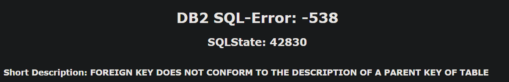

# Bootcamp Final Project<br>
Authors:<br>
    Mitch Neuenschwander<br>
    Andy Kawamoto<br>
    Kelvin Molina<br>
    Grayson Workman<br>

## Deliverable 1: EDA Deep Dives, And Choosing A Topic.
### Introduction
HYPOTHESIS
Our null hypothesis is “Using only game stats of each NBA player, it is not possible to determine the Most Valuable Player (MVP).  Our alternative hypothesis is with Machine Learning, the Most Valuable Player (MVP) of the NBA can be predicted using the game stats of each player over the course of the regular season.”  In addition, our goal was to see if we could do it at a different point of the season such as the, trade deadline in February.  
DATA gathering
Google, Kaggle, NBA Stuffer, and ESPN, were the primary places we looked for data.  We wanted as much information as possible and started what we considered the “modern NBA” which was the 1980-1981 season.   We were able to find 5 data sets which contained all the data we thought we would need.

### Week 1
The first Deliverable of the Final Challenge is straightforward. The goal was to decide on a question, find a dataset that would allow us to answer it effectively, and begin manipulation and prototype modeling of that set. 

The question we decided on came after a long while, and after bouncing from facet to facet within the same subject: the prediction of the NBA's next pool of MVP candidates, more specificallly which factors made a player more likely to be selected. Using a dataset from Kaggle, we ammassed a trove of data to be looked through, and began the EDA process to know what we were working with.

We decided on a self-titled "rubberband" approach, where we started in Python, moved to SQL for further manipulation and final table generation, and then back to Python to prototype and run a Machine Learning model. The model type has yet to be decided, but a Supervised Machine Learner is so far looking to be the most appropriate. On what we thought to be the completion of cleaning the data, the usual SQL challenges were present, cheifly surrounding the CSV imports to their respective tables. After several unsuccessful brute-force attempts and subsequently further EDA, we found that the various Date and Time columns were mis-typed as objects, and they would not be accepted by our database. Further cleaning was warranted to format those column values correctly, and eliminate a handful of newly-minted null values and columns from the remade CSVs. 

Ultimately, it is a good excersize in understanding that even though work looks complete, there will occasionally need to be backtracking and further modification before returning to a workable point. This is the first "real" dataset that we have worked with, in that it is raw and unedited by the Bootcamp Curriculum. It's nice to see the methods we've learned being applied in a "real-world" situation, and knowing it works without a starter code or a framework already in place.

#### Database
The work around the database highlighted the difficulty in the data cleanup steps prior to using a machine learning model.  We had to address duplicates, nulls, non-unique values, columns with mixed datatypes, or datatypes that didn't seem to line up well from Python to SQL.  There was a lot of work around determine which data or time information we needed and how to format it correctly.  

We used pgAdmin as our database program and quickdatabase.com as our ERD generator.  There was a lot of troublshooting that had to be researched based on the error codes displayed when either creating the tables or when uploading the data into the table. Error codes such as:
  

We created 4 tables for our data:
* games
* games_details
* teams
* player 

We decided we only needed to connect **games, game_details,** and **teams**.  

At first, extra columns needed to be removed as they were not lining up with the generated schema. Steps were taken to address this, as mentioned above. The biggest hurdle was to find unique columns or Primary Keys to link the table together, so composite primary keys were created. As a group we had to decide which information was important for our model, and as a result modified the **ranking.csv** to a **teams.csv** which listed the teams in the NBA. We also decided that the **players.csv** will be cross referenced after the machine learning model determines which players are in contention for the MVP based on their player_ID number.   We then had to modify the SQL code and the CSV's so they matched appropriately and were able to successfully load our data into the database with appropraitely connected tables. 

Once the database was fully operational, it was time to disect each table and extract the important columns from each table and join them into a completely new table, which brought new obstacles for our team. Some of the column names in the tables were also function keys, so to correct this issue, we decided to put all of the column titles in quotes(" "). To get all of the columns we wanted, we joined the tables with a regular join between them so none of the data was lost or duplicated. We pushed all of the columns into a new table named **nba_info**. Here is a look into the SQL query used to create the new table.
```
SELECT "GAME_ID", "TEAM_ID", "PLAYER_ID", "PLAYER_NAME", 
"MIN", "FGM", "FGA", "FG_PCT", "FG3M", 
"FG3A", "FG3_PCT", "FTM", "FTA", "FT_PCT", 
"REB", "AST", "STL", "BLK", "TO", "PTS"
INTO nba_details2
FROM game_details; 

SELECT  gm."GAME_DATE_EST", gm."GAME_ID", gm."HOME_TEAM_ID",
    gm."VISITOR_TEAM_ID", gm."SEASON", gm."TEAM_ID_home", 
    gm."HOME_TEAM_WINS",tm."TEAM_ID", tm."CONFERENCE", tm."TEAM",
	nd."PLAYER_ID", nd."PLAYER_NAME", 
nd."MIN", nd."FGM", nd."FGA", nd."FG_PCT", nd."FG3M", 
nd."FG3A", nd."FG3_PCT", nd."FTM", nd."FTA", nd."FT_PCT", 
nd."REB", nd."AST", nd."STL", nd."BLK", nd."TO", nd."PTS"
INTO nba_info
FROM games as gm
JOIN nba_details2 as nd
ON gm."GAME_ID" = nd."GAME_ID"
join teams as tm 
on tm."TEAM_ID" = nd."TEAM_ID"
```

We could have pulled all of the tables directly from Pgadmin using Python by writing code like the following:
```
import psycopg2
import requests

conn = psycopg2.connect(
            host = "localhost",
            database = "final_project",
            user = "postgres",
            password = "****")

cur = conn.cursor()

nba_data = cur.execute("select * from nba_info")

nba_data = cur.fetchall()

print(nba_data)
```
but with multiple people working on this project, we decided to transfer the new table into a .csv file so it may be accessible for everyone without creating a Postgres database for each member.

### Machine Learning
The machine learning section was the most anticipated and yet anti-climactic section of the project to date. We had assumed that the model would be based off the [award_share] column in mvp_voting.csv, and that would allow porting of the model to the Global NBA info, but quickly determined that we were missing the same award_share column from nba_data.csv, which was the ultimate goal; to determine an NBA MVP using the preestablished MVP info from the NBA datasheet containing all players. 

The first and greatest issue was the model type. We had started initially targeting a supervised model, but during further EDA discovered we didn't *really* have a target column, as is required by a supervised model. We attempted to address this issue by creating a KMeans model and adding a cluster designation for each player, which worked, but in turn raised a host of other questions. For instance, how were the players clustered out? Which stats were most important when compared to a group pool? Which seasons had the most chances of winning an MVP, per stat tracked? All of these, along with a limited knowledge of Machine Models and networks, were enough to put the kybosh on creating a workable model.

We started with a RandomForestClassifier, and split the data into its respective training and testing sets. This mostly went off without a hitch, but as soon as we attempted to load the model we discovered that the data type was not going to work with the model. Specifically, the data was classed as 'continuous' when it needed to be 'discrete'. In layman's terms, the count never ended. There was not a set start or end point for the data, and this made it so the model (which classifies based on 'yes' or 'no' answers) was not able to be run. With that in mind, we shifted to a Deep Learning Network.

It is not reflected in the NN_Bootcamp_Challenge.ipynb itself, but we tried multiple configurations of neurons and layers, all of which led to the same result: 0% Accuracy, and roughly a ~30% data loss. The initial model performed the best, but at a 0% accuracy across the board can that be considered 'better'? At the end of it all, we have determined that we do not have enough data to determine a candidate pool. The greatest roadblock here concerns simply more enigmatic data, such as league politics, player perception across a season, on and off court actions, and voting momentum based on the above. 

### Challenges
Clearly no one expected this entire analysis to go smoothly without any challenges. From the start, the journey to find the right data that will work for our analysis. We looked at web scraping options, other sports sites that provided documentation. We chose data from Kaggle. Although we chose the best data, from the beginning we learned that we needed to modify all of our data and remove columns and then create new columns. Then new errors would arise trying to upload the data into postgres. While trying to build the ERD the foreign keys would not link with each other accross all of the tables. Preprocessing the tables took the bulk of our time during this project. We had constant and ongoing EDA. EDA never ends as you learn more about your data as you go. The machine learning model was especially difficult. We tried multiple models like unsupervised, supervised and even a neural Network machine learning. Our Test train split wouldn't work, the "target"column was tricky because MVP is won by votes, so it was difficult to name one stat to be the value that determines MVP.

After many attempts, we finally had to admit that all of our machine learning models did not work. This was the biggest hurdle to overcome because we felt defeated that after that much effort, our test results showed us a 0% accuracy. We needed to regroup and find another way to provide helpful information. 

Tableau came with different challenges. The value in tableau came from trying to represent the data in a matter that is appealing to our viewers. Trying to get our story accross was difficult and we needed to create many different attempts. Placing tables in the rows section, then moving them to the columns. Finding out neither option worked, and then trying different charts. Other issues were trying to make visuals look appealing. Trying to add backgrounds was not as easy as it sounds when using Tableau.


 ### Tableau
https://public.tableau.com/app/profile/grayson.w./viz/NBA_MVP_UofUDS/NBAMVPBreakdown?publish=yes


rules change
the old players still hold up very well compared to the current modern style players where it is all very offensively driven

### Conclusion 